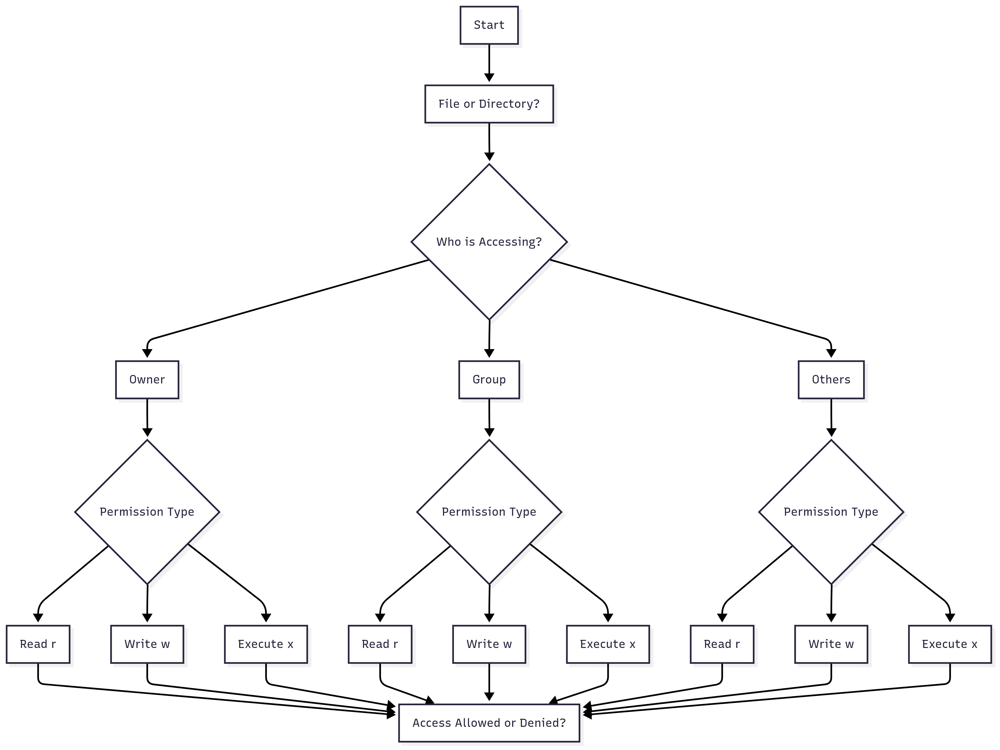
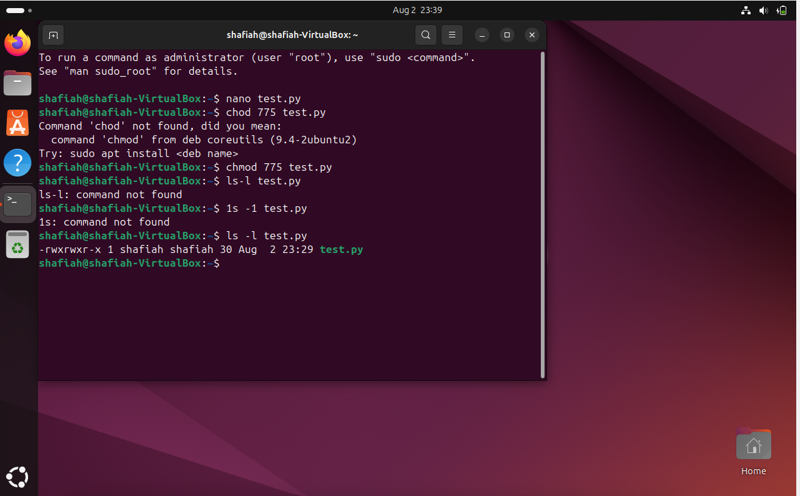
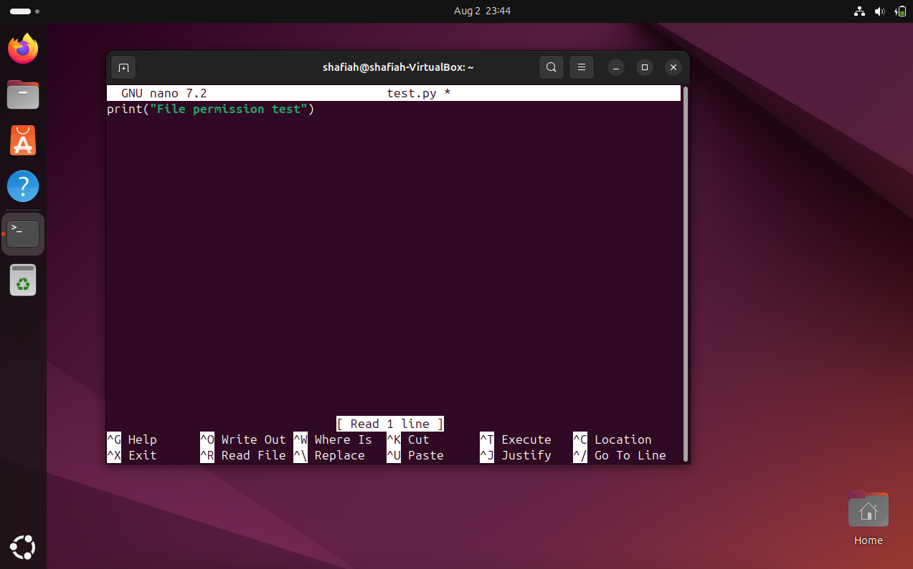

# Linux File Permissions – chmod Practice

This project demonstrates understanding and application of Linux file permissions using the `chmod` command on a Python file.

---

##  Understanding File Permissions

In Linux, each file has permissions that control who can read, write, or execute it.

There are **three types of permissions**:
- `r` → Read
- `w` → Write
- `x` → Execute

And **three levels of access**:
- **Owner** (the file's creator)
- **Group** (users in the same group)
- **Others** (everyone else)

---

##  Permissions Flowchart
  

##  Task: Apply chmod to a Python File

### 1- Create a file:
nano test.py
### 2- Add simple content
print("Testing permissions")
### 3-Save and exit:
Ctrl + O, Enter, then Ctrl + X
### 4-Apply chmod to set permissions to rwxrwxr-x:
chmod 775 test.py
### 5- Confirm the new permissions:
ls -l test.py

## Expected output:

